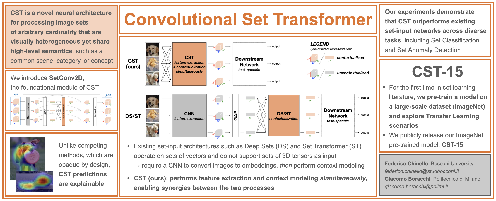

# Convolutional Set Transformer

The **cstmodels** package provides the reference implementation of the Convolutional Set Transformer (Chinello & Boracchi, 2025). It includes reusable Keras 3 layers for building CST architectures, and provides an easy interface to load and use CST-15, the first set-learning backbone pre-trained on ImageNet.

If you have any questions or concerns, please feel free to contact me at federico.chinello@studbocconi.it.

## Table of Contents
- [About Convolutional Set Transformers](#about-convolutional-set-transformers)
- [Installation](#installation)
- [Loading CST-15](#loading-cst-15)
- [Building a CST from scratch](#building-a-cst-from-scratch)
- [Tutorial Notebooks](#tutorial-notebooks)

## About Convolutional Set Transformers



### Highlights:
- CST is a novel deep learning architecture for processing **image sets of arbitrary cardinality** that are visually heterogeneous yet share high-level semantics (e.g., a common category, scene, or concept).
- CST is general-purpose and supports a broad range of applications, including **set-based classification** tasks and **Set Anomaly Detection**.
- In the domain of image-set processing, CST **outperforms existing set-learning approaches** such as [Deep Sets](https://arxiv.org/abs/1703.06114) and [Set Transformer](https://arxiv.org/abs/1810.00825). Unlike these methods, which are inherently opaque, CST is fully compatible with standard CNN **explainability** tools, including Grad-CAM.
- While Deep Sets and Set Transformer are typically trained from scratch, **CST supports Transfer Learning**: it can be pre-trained on large-scale datasets and then effectively adapted to diverse downstream tasks. We publicly release **CST-15, the first set-learning backbone pre-trained on ImageNet**.

Want to dive deeper? Check out our paper!


*Unlike Deep Sets and Set Transformer, which are inherently opaque, CST is fully compatible with standard CNN explainability tools. The Figure above shows Grad-CAM overlays for an image set provided as input to CST-15, with respect to the ground-truth class.*

## Installation

You can install the latest release of **cstmodels** from PyPI:

```bash
pip install cstmodels
```

## Loading CST-15

Instantiate CST-15 with or without pre-trained ImageNet weights:

```python
from cstmodels import CST15

model = CST15(pretrained=True)
```

## Building a CST from scratch

The package provides the tools needed to build a Convolutional Set Transformer from the ground up, including:

- **SetConv2D**: the reference implementation of the SetConv2D block introduced in Chinello & Boracchi, 2025.  
- **SmartReshape2D**: a utility layer that reshapes tensors depending on whether a set dimension  
  is present. It automatically converts between  
  - `(batch, set_size, H, W, C)` → `(batch*set_size, H, W, C)`  
  - `(batch*set_size, H, W, C)` → `(batch, set_size, H, W, C)`  
  This is useful when switching between layers that operate per-image and those that require an  
  explicit set structure.

```python
from keras import layers
from cstmodels import SetConv2D, SmartReshape2D

def CST():
    input_layer = layers.Input(shape=(None, None, None, 3))
    # Input is: (batch_size, set_size, heigh, width, channels)
    # We reshape to: (batch_size * set_size, heigh, width, channels)
    x, set_size = SmartReshape2D()(input_layer)

    x = SetConv2D(32, 3, activation='relu', padding='same')(
        x, set_size=set_size
    )
    x = SetConv2D(32, 3, activation='relu', padding='same')(
        x, set_size=set_size
    )
    x = layers.MaxPooling2D()(x)

    x = SetConv2D(64, 3, activation='relu', padding='same')(
        x, set_size=set_size
    )
    x = SetConv2D(64, 3, activation='relu', padding='same')(
        x, set_size=set_size
    )
    x = layers.MaxPooling2D()(x)

    x = SetConv2D(128, 3, activation='relu', padding='same')(
        x, set_size=set_size
    )
    x = SetConv2D(128, 3, activation='relu', padding='same')(
        x, set_size=set_size
    )
    x = layers.MaxPooling2D()(x)

    x = layers.GlobalAveragePooling2D()(x) # -> (batch_size * set_size, channels)

    output_layer = layers.Dense(units=10, activation='softmax')(x)

    model = keras.Model(inputs=input_layer, outputs=output_layer)

    return model

model = CST()
```

## Tutorial Notebooks

We provide two self-contained tutorials notebooks:  
- **`cst_from_scratch.ipynb`** demonstrates how to build and train a CST from scratch on the CIFAR-10 dataset;  
- **`cst15_transfer_learning.ipynb`** illustrates how to adapt the pre-trained CST-15 backbone to new tasks, using colorectal histopathology images as a case study for Transfer Learning.  